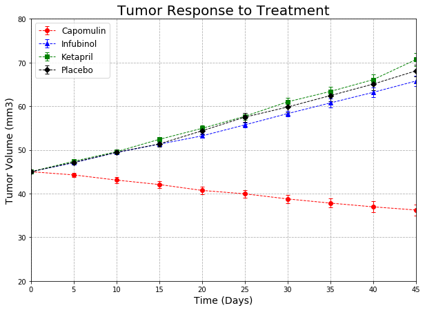
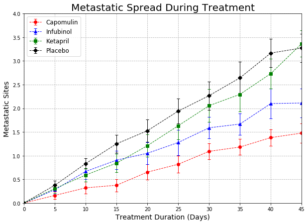
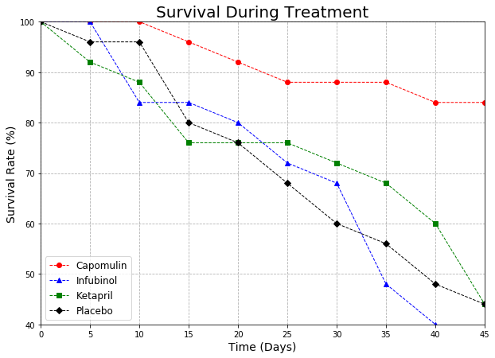
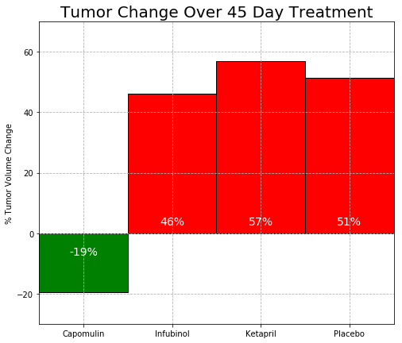

# Pymaceuticals

# Results and Conclusions 

1. The study analyzed ten different drugs and their effects on tumor volume in a sample of 250 mice.  We then looked at four drugs in particular (Capomulin, Infubinol, Ketapril, and Placebo) over a 45 day span.  The Ketapril, Infubinol, and Placebo all experienced average increases of tumor volume over 45% while the Capomulin showed a reduction of 19%.

2. Ketapril resulted in the largest number of meatstatic sites at the conclusion of our trial, overtaking the Placebo during the very last days.  Capomulin resulted in the lowest number of metastatic sites throughout the 45 days.

3. Capomulin also proved to be the best treatment when considering survivability with 21 mice living through our trial.  Only 9 mice on the Infubinol treatment survived the duration of the trial.

After the 45 day trial, Capomulin is clearly the best treatment option.  Capomulin was the only drug with a reduction in tumor volume, had the highest survivability rate and the best outcomes on metastatic spread.  No other drug appears to be a viable alternative based on our data.

It is important to mention some limitations of the research such as the credibility of the results based on the small sample size (25 mice per drug).  Without leveraging hypothesis testing we cannot make any significant conclusions.


```python
# Dependencies
import matplotlib.pyplot as plt
import seaborn as sns
import numpy as np
import pandas as pd
import os
```


```python
# Create file paths for raw data
tumor_dataCSV = os.path.join('raw_data', 'clinicaltrial_data.csv')
# Read the CSV file into a Pandas DataFrame
tumor_data = pd.read_csv(tumor_dataCSV)
tumor_data.head()
```


<div>
<style scoped>
    .dataframe tbody tr th:only-of-type {
        vertical-align: middle;
    }

    .dataframe tbody tr th {
        vertical-align: top;
    }

    .dataframe thead th {
        text-align: right;
    }
</style>
<table border="1" class="dataframe">
  <thead>
    <tr style="text-align: right;">
      <th></th>
      <th>Mouse ID</th>
      <th>Timepoint</th>
      <th>Tumor Volume (mm3)</th>
      <th>Metastatic Sites</th>
    </tr>
  </thead>
  <tbody>
    <tr>
      <th>0</th>
      <td>b128</td>
      <td>0</td>
      <td>45.0</td>
      <td>0</td>
    </tr>
    <tr>
      <th>1</th>
      <td>f932</td>
      <td>0</td>
      <td>45.0</td>
      <td>0</td>
    </tr>
    <tr>
      <th>2</th>
      <td>g107</td>
      <td>0</td>
      <td>45.0</td>
      <td>0</td>
    </tr>
    <tr>
      <th>3</th>
      <td>a457</td>
      <td>0</td>
      <td>45.0</td>
      <td>0</td>
    </tr>
    <tr>
      <th>4</th>
      <td>c819</td>
      <td>0</td>
      <td>45.0</td>
      <td>0</td>
    </tr>
  </tbody>
</table>
</div>


```python
# Create file paths for raw data
drug_dataCSV = os.path.join('raw_data', 'mouse_drug_data.csv')
# Read the CSV file into a Pandas DataFrame
drug_data = pd.read_csv(drug_dataCSV)
drug_data.head()
```


<div>
<style scoped>
    .dataframe tbody tr th:only-of-type {
        vertical-align: middle;
    }

    .dataframe tbody tr th {
        vertical-align: top;
    }

    .dataframe thead th {
        text-align: right;
    }
</style>
<table border="1" class="dataframe">
  <thead>
    <tr style="text-align: right;">
      <th></th>
      <th>Mouse ID</th>
      <th>Drug</th>
    </tr>
  </thead>
  <tbody>
    <tr>
      <th>0</th>
      <td>f234</td>
      <td>Stelasyn</td>
    </tr>
    <tr>
      <th>1</th>
      <td>x402</td>
      <td>Stelasyn</td>
    </tr>
    <tr>
      <th>2</th>
      <td>a492</td>
      <td>Stelasyn</td>
    </tr>
    <tr>
      <th>3</th>
      <td>w540</td>
      <td>Stelasyn</td>
    </tr>
    <tr>
      <th>4</th>
      <td>v764</td>
      <td>Stelasyn</td>
    </tr>
  </tbody>
</table>
</div>


```python
#Merge the two dataframes and call the resulting df
trial_df = pd.merge(tumor_data, drug_data, how='outer', on='Mouse ID')
trial_df.head()
```


<div>
<style scoped>
    .dataframe tbody tr th:only-of-type {
        vertical-align: middle;
    }

    .dataframe tbody tr th {
        vertical-align: top;
    }

    .dataframe thead th {
        text-align: right;
    }
</style>
<table border="1" class="dataframe">
  <thead>
    <tr style="text-align: right;">
      <th></th>
      <th>Mouse ID</th>
      <th>Timepoint</th>
      <th>Tumor Volume (mm3)</th>
      <th>Metastatic Sites</th>
      <th>Drug</th>
    </tr>
  </thead>
  <tbody>
    <tr>
      <th>0</th>
      <td>b128</td>
      <td>0</td>
      <td>45.000000</td>
      <td>0</td>
      <td>Capomulin</td>
    </tr>
    <tr>
      <th>1</th>
      <td>b128</td>
      <td>5</td>
      <td>45.651331</td>
      <td>0</td>
      <td>Capomulin</td>
    </tr>
    <tr>
      <th>2</th>
      <td>b128</td>
      <td>10</td>
      <td>43.270852</td>
      <td>0</td>
      <td>Capomulin</td>
    </tr>
    <tr>
      <th>3</th>
      <td>b128</td>
      <td>15</td>
      <td>43.784893</td>
      <td>0</td>
      <td>Capomulin</td>
    </tr>
    <tr>
      <th>4</th>
      <td>b128</td>
      <td>20</td>
      <td>42.731552</td>
      <td>0</td>
      <td>Capomulin</td>
    </tr>
  </tbody>
</table>
</div>


# Tumor Response to Treatment


```python
# Mean Tumor Volume by Drug name and Timepoint
Tumor_group_df = trial_df.groupby(['Drug','Timepoint'])
Tumor_mean_df = pd.DataFrame(Tumor_group_df ["Tumor Volume (mm3)"].mean())
Tumor_mean_df
```


<div>
<style scoped>
    .dataframe tbody tr th:only-of-type {
        vertical-align: middle;
    }

    .dataframe tbody tr th {
        vertical-align: top;
    }

    .dataframe thead th {
        text-align: right;
    }
</style>
<table border="1" class="dataframe">
  <thead>
    <tr style="text-align: right;">
      <th></th>
      <th></th>
      <th>Tumor Volume (mm3)</th>
    </tr>
    <tr>
      <th>Drug</th>
      <th>Timepoint</th>
      <th></th>
    </tr>
  </thead>
  <tbody>
    <tr>
      <th rowspan="10" valign="top">Capomulin</th>
      <th>0</th>
      <td>45.000000</td>
    </tr>
    <tr>
      <th>5</th>
      <td>44.266086</td>
    </tr>
    <tr>
      <th>10</th>
      <td>43.084291</td>
    </tr>
    <tr>
      <th>15</th>
      <td>42.064317</td>
    </tr>
    <tr>
      <th>20</th>
      <td>40.716325</td>
    </tr>
    <tr>
      <th>25</th>
      <td>39.939528</td>
    </tr>
    <tr>
      <th>30</th>
      <td>38.769339</td>
    </tr>
    <tr>
      <th>35</th>
      <td>37.816839</td>
    </tr>
    <tr>
      <th>40</th>
      <td>36.958001</td>
    </tr>
    <tr>
      <th>45</th>
      <td>36.236114</td>
    </tr>
    <tr>
      <th rowspan="10" valign="top">Ceftamin</th>
      <th>0</th>
      <td>45.000000</td>
    </tr>
    <tr>
      <th>5</th>
      <td>46.503051</td>
    </tr>
    <tr>
      <th>10</th>
      <td>48.285125</td>
    </tr>
    <tr>
      <th>15</th>
      <td>50.094055</td>
    </tr>
    <tr>
      <th>20</th>
      <td>52.157049</td>
    </tr>
    <tr>
      <th>25</th>
      <td>54.287674</td>
    </tr>
    <tr>
      <th>30</th>
      <td>56.769517</td>
    </tr>
    <tr>
      <th>35</th>
      <td>58.827548</td>
    </tr>
    <tr>
      <th>40</th>
      <td>61.467895</td>
    </tr>
    <tr>
      <th>45</th>
      <td>64.132421</td>
    </tr>
    <tr>
      <th rowspan="10" valign="top">Infubinol</th>
      <th>0</th>
      <td>45.000000</td>
    </tr>
    <tr>
      <th>5</th>
      <td>47.062001</td>
    </tr>
    <tr>
      <th>10</th>
      <td>49.403909</td>
    </tr>
    <tr>
      <th>15</th>
      <td>51.296397</td>
    </tr>
    <tr>
      <th>20</th>
      <td>53.197691</td>
    </tr>
    <tr>
      <th>25</th>
      <td>55.715252</td>
    </tr>
    <tr>
      <th>30</th>
      <td>58.299397</td>
    </tr>
    <tr>
      <th>35</th>
      <td>60.742461</td>
    </tr>
    <tr>
      <th>40</th>
      <td>63.162824</td>
    </tr>
    <tr>
      <th>45</th>
      <td>65.755562</td>
    </tr>
    <tr>
      <th>...</th>
      <th>...</th>
      <td>...</td>
    </tr>
    <tr>
      <th rowspan="10" valign="top">Ramicane</th>
      <th>0</th>
      <td>45.000000</td>
    </tr>
    <tr>
      <th>5</th>
      <td>43.944859</td>
    </tr>
    <tr>
      <th>10</th>
      <td>42.531957</td>
    </tr>
    <tr>
      <th>15</th>
      <td>41.495061</td>
    </tr>
    <tr>
      <th>20</th>
      <td>40.238325</td>
    </tr>
    <tr>
      <th>25</th>
      <td>38.974300</td>
    </tr>
    <tr>
      <th>30</th>
      <td>38.703137</td>
    </tr>
    <tr>
      <th>35</th>
      <td>37.451996</td>
    </tr>
    <tr>
      <th>40</th>
      <td>36.574081</td>
    </tr>
    <tr>
      <th>45</th>
      <td>34.955595</td>
    </tr>
    <tr>
      <th rowspan="10" valign="top">Stelasyn</th>
      <th>0</th>
      <td>45.000000</td>
    </tr>
    <tr>
      <th>5</th>
      <td>47.527452</td>
    </tr>
    <tr>
      <th>10</th>
      <td>49.463844</td>
    </tr>
    <tr>
      <th>15</th>
      <td>51.529409</td>
    </tr>
    <tr>
      <th>20</th>
      <td>54.067395</td>
    </tr>
    <tr>
      <th>25</th>
      <td>56.166123</td>
    </tr>
    <tr>
      <th>30</th>
      <td>59.826738</td>
    </tr>
    <tr>
      <th>35</th>
      <td>62.440699</td>
    </tr>
    <tr>
      <th>40</th>
      <td>65.356386</td>
    </tr>
    <tr>
      <th>45</th>
      <td>68.438310</td>
    </tr>
    <tr>
      <th rowspan="10" valign="top">Zoniferol</th>
      <th>0</th>
      <td>45.000000</td>
    </tr>
    <tr>
      <th>5</th>
      <td>46.851818</td>
    </tr>
    <tr>
      <th>10</th>
      <td>48.689881</td>
    </tr>
    <tr>
      <th>15</th>
      <td>50.779059</td>
    </tr>
    <tr>
      <th>20</th>
      <td>53.170334</td>
    </tr>
    <tr>
      <th>25</th>
      <td>55.432935</td>
    </tr>
    <tr>
      <th>30</th>
      <td>57.713531</td>
    </tr>
    <tr>
      <th>35</th>
      <td>60.089372</td>
    </tr>
    <tr>
      <th>40</th>
      <td>62.916692</td>
    </tr>
    <tr>
      <th>45</th>
      <td>65.960888</td>
    </tr>
  </tbody>
</table>
<p>100 rows × 1 columns</p>
</div>


```python
# Standard Error by Drug name and Timepoint
Tumor_sem_df = pd.DataFrame(Tumor_group_df ["Tumor Volume (mm3)"].sem())
Tumor_sem_df.head()
```


<div>
<style scoped>
    .dataframe tbody tr th:only-of-type {
        vertical-align: middle;
    }

    .dataframe tbody tr th {
        vertical-align: top;
    }

    .dataframe thead th {
        text-align: right;
    }
</style>
<table border="1" class="dataframe">
  <thead>
    <tr style="text-align: right;">
      <th></th>
      <th></th>
      <th>Tumor Volume (mm3)</th>
    </tr>
    <tr>
      <th>Drug</th>
      <th>Timepoint</th>
      <th></th>
    </tr>
  </thead>
  <tbody>
    <tr>
      <th rowspan="5" valign="top">Capomulin</th>
      <th>0</th>
      <td>0.000000</td>
    </tr>
    <tr>
      <th>5</th>
      <td>0.448593</td>
    </tr>
    <tr>
      <th>10</th>
      <td>0.702684</td>
    </tr>
    <tr>
      <th>15</th>
      <td>0.838617</td>
    </tr>
    <tr>
      <th>20</th>
      <td>0.909731</td>
    </tr>
  </tbody>
</table>
</div>


```python
# Create dataframe that will be used for plot
tumor_plot_df = Tumor_mean_df.unstack(0)
tumor_plot_df_2 = tumor_plot_df["Tumor Volume (mm3)"]
tumor_plot_df_2
```


<div>
<style scoped>
    .dataframe tbody tr th:only-of-type {
        vertical-align: middle;
    }

    .dataframe tbody tr th {
        vertical-align: top;
    }

    .dataframe thead th {
        text-align: right;
    }
</style>
<table border="1" class="dataframe">
  <thead>
    <tr style="text-align: right;">
      <th>Drug</th>
      <th>Capomulin</th>
      <th>Ceftamin</th>
      <th>Infubinol</th>
      <th>Ketapril</th>
      <th>Naftisol</th>
      <th>Placebo</th>
      <th>Propriva</th>
      <th>Ramicane</th>
      <th>Stelasyn</th>
      <th>Zoniferol</th>
    </tr>
    <tr>
      <th>Timepoint</th>
      <th></th>
      <th></th>
      <th></th>
      <th></th>
      <th></th>
      <th></th>
      <th></th>
      <th></th>
      <th></th>
      <th></th>
    </tr>
  </thead>
  <tbody>
    <tr>
      <th>0</th>
      <td>45.000000</td>
      <td>45.000000</td>
      <td>45.000000</td>
      <td>45.000000</td>
      <td>45.000000</td>
      <td>45.000000</td>
      <td>45.000000</td>
      <td>45.000000</td>
      <td>45.000000</td>
      <td>45.000000</td>
    </tr>
    <tr>
      <th>5</th>
      <td>44.266086</td>
      <td>46.503051</td>
      <td>47.062001</td>
      <td>47.389175</td>
      <td>46.796098</td>
      <td>47.125589</td>
      <td>47.248967</td>
      <td>43.944859</td>
      <td>47.527452</td>
      <td>46.851818</td>
    </tr>
    <tr>
      <th>10</th>
      <td>43.084291</td>
      <td>48.285125</td>
      <td>49.403909</td>
      <td>49.582269</td>
      <td>48.694210</td>
      <td>49.423329</td>
      <td>49.101541</td>
      <td>42.531957</td>
      <td>49.463844</td>
      <td>48.689881</td>
    </tr>
    <tr>
      <th>15</th>
      <td>42.064317</td>
      <td>50.094055</td>
      <td>51.296397</td>
      <td>52.399974</td>
      <td>50.933018</td>
      <td>51.359742</td>
      <td>51.067318</td>
      <td>41.495061</td>
      <td>51.529409</td>
      <td>50.779059</td>
    </tr>
    <tr>
      <th>20</th>
      <td>40.716325</td>
      <td>52.157049</td>
      <td>53.197691</td>
      <td>54.920935</td>
      <td>53.644087</td>
      <td>54.364417</td>
      <td>53.346737</td>
      <td>40.238325</td>
      <td>54.067395</td>
      <td>53.170334</td>
    </tr>
    <tr>
      <th>25</th>
      <td>39.939528</td>
      <td>54.287674</td>
      <td>55.715252</td>
      <td>57.678982</td>
      <td>56.731968</td>
      <td>57.482574</td>
      <td>55.504138</td>
      <td>38.974300</td>
      <td>56.166123</td>
      <td>55.432935</td>
    </tr>
    <tr>
      <th>30</th>
      <td>38.769339</td>
      <td>56.769517</td>
      <td>58.299397</td>
      <td>60.994507</td>
      <td>59.559509</td>
      <td>59.809063</td>
      <td>58.196374</td>
      <td>38.703137</td>
      <td>59.826738</td>
      <td>57.713531</td>
    </tr>
    <tr>
      <th>35</th>
      <td>37.816839</td>
      <td>58.827548</td>
      <td>60.742461</td>
      <td>63.371686</td>
      <td>62.685087</td>
      <td>62.420615</td>
      <td>60.350199</td>
      <td>37.451996</td>
      <td>62.440699</td>
      <td>60.089372</td>
    </tr>
    <tr>
      <th>40</th>
      <td>36.958001</td>
      <td>61.467895</td>
      <td>63.162824</td>
      <td>66.068580</td>
      <td>65.600754</td>
      <td>65.052675</td>
      <td>63.045537</td>
      <td>36.574081</td>
      <td>65.356386</td>
      <td>62.916692</td>
    </tr>
    <tr>
      <th>45</th>
      <td>36.236114</td>
      <td>64.132421</td>
      <td>65.755562</td>
      <td>70.662958</td>
      <td>69.265506</td>
      <td>68.084082</td>
      <td>66.258529</td>
      <td>34.955595</td>
      <td>68.438310</td>
      <td>65.960888</td>
    </tr>
  </tbody>
</table>
</div>


```python
#Creating the Plot

#define x-axis
x_axis = [0,5,10,15,20,25,30,35,40,45]
x_limit = 45
plt.figure(figsize=(10,7))

#Define each drug
error = Tumor_sem_df["Tumor Volume (mm3)"]["Capomulin"]
Capomulin = plt.errorbar(x_axis, tumor_plot_df_2["Capomulin"], yerr=error, fmt="o", color="red", ls="dashed", linewidth=1, alpha=1, capsize=3)

error = Tumor_sem_df["Tumor Volume (mm3)"]["Infubinol"]
Infubinol = plt.errorbar(x_axis, tumor_plot_df_2["Infubinol"], yerr=error, fmt="^", color="blue", ls="dashed", linewidth=1, alpha=1, capsize=3)

error = Tumor_sem_df["Tumor Volume (mm3)"]["Ketapril"]
Ketapril = plt.errorbar(x_axis, tumor_plot_df_2["Ketapril"], yerr=error, fmt="s", color="green", ls="dashed", linewidth=1, alpha=1, capsize=3)

error = Tumor_sem_df["Tumor Volume (mm3)"]["Placebo"]
Placebo = plt.errorbar(x_axis, tumor_plot_df_2["Placebo"], yerr=error, fmt="D", color="black", ls="dashed", linewidth=1, alpha=1, capsize=3)

#Axes limits
plt.ylim(20, 80)
plt.xlim(0, 45)

#Axes and Chart Labels
plt.title("Tumor Response to Treatment", fontsize=20)
plt.xlabel("Time (Days)", fontsize=14)
plt.ylabel("Tumor Volume (mm3)", fontsize=14)
plt.grid(linestyle="dashed")

#Chart Legend 
plt.legend((Capomulin, Infubinol, Ketapril, Placebo), ("Capomulin", "Infubinol", "Ketapril", "Placebo"), fontsize=12)
plt.show()
```





# Metastatic Response to Treatment


```python
# Metastatic sites by Drug
Metastasis_mean_df = pd.DataFrame(Tumor_group_df ["Metastatic Sites"].mean())
Metastasis_mean_df.head()
```


<div>
<style scoped>
    .dataframe tbody tr th:only-of-type {
        vertical-align: middle;
    }

    .dataframe tbody tr th {
        vertical-align: top;
    }

    .dataframe thead th {
        text-align: right;
    }
</style>
<table border="1" class="dataframe">
  <thead>
    <tr style="text-align: right;">
      <th></th>
      <th></th>
      <th>Metastatic Sites</th>
    </tr>
    <tr>
      <th>Drug</th>
      <th>Timepoint</th>
      <th></th>
    </tr>
  </thead>
  <tbody>
    <tr>
      <th rowspan="5" valign="top">Capomulin</th>
      <th>0</th>
      <td>0.000000</td>
    </tr>
    <tr>
      <th>5</th>
      <td>0.160000</td>
    </tr>
    <tr>
      <th>10</th>
      <td>0.320000</td>
    </tr>
    <tr>
      <th>15</th>
      <td>0.375000</td>
    </tr>
    <tr>
      <th>20</th>
      <td>0.652174</td>
    </tr>
  </tbody>
</table>
</div>


```python
# Metastatic sites by Drug Standard Error
Metastasis_sem_df = pd.DataFrame(Tumor_group_df ["Metastatic Sites"].sem())
Metastasis_sem_df.head()
```


<div>
<style scoped>
    .dataframe tbody tr th:only-of-type {
        vertical-align: middle;
    }

    .dataframe tbody tr th {
        vertical-align: top;
    }

    .dataframe thead th {
        text-align: right;
    }
</style>
<table border="1" class="dataframe">
  <thead>
    <tr style="text-align: right;">
      <th></th>
      <th></th>
      <th>Metastatic Sites</th>
    </tr>
    <tr>
      <th>Drug</th>
      <th>Timepoint</th>
      <th></th>
    </tr>
  </thead>
  <tbody>
    <tr>
      <th rowspan="5" valign="top">Capomulin</th>
      <th>0</th>
      <td>0.000000</td>
    </tr>
    <tr>
      <th>5</th>
      <td>0.074833</td>
    </tr>
    <tr>
      <th>10</th>
      <td>0.125433</td>
    </tr>
    <tr>
      <th>15</th>
      <td>0.132048</td>
    </tr>
    <tr>
      <th>20</th>
      <td>0.161621</td>
    </tr>
  </tbody>
</table>
</div>


```python
# Create dataframe that will be used for plot
meta_plot_df = Metastasis_mean_df.unstack(0)
meta_plot_df_2 = meta_plot_df["Metastatic Sites"]
meta_plot_df_2
```


<div>
<style scoped>
    .dataframe tbody tr th:only-of-type {
        vertical-align: middle;
    }

    .dataframe tbody tr th {
        vertical-align: top;
    }

    .dataframe thead th {
        text-align: right;
    }
</style>
<table border="1" class="dataframe">
  <thead>
    <tr style="text-align: right;">
      <th>Drug</th>
      <th>Capomulin</th>
      <th>Ceftamin</th>
      <th>Infubinol</th>
      <th>Ketapril</th>
      <th>Naftisol</th>
      <th>Placebo</th>
      <th>Propriva</th>
      <th>Ramicane</th>
      <th>Stelasyn</th>
      <th>Zoniferol</th>
    </tr>
    <tr>
      <th>Timepoint</th>
      <th></th>
      <th></th>
      <th></th>
      <th></th>
      <th></th>
      <th></th>
      <th></th>
      <th></th>
      <th></th>
      <th></th>
    </tr>
  </thead>
  <tbody>
    <tr>
      <th>0</th>
      <td>0.000000</td>
      <td>0.000000</td>
      <td>0.000000</td>
      <td>0.000000</td>
      <td>0.000000</td>
      <td>0.000000</td>
      <td>0.000000</td>
      <td>0.000000</td>
      <td>0.000000</td>
      <td>0.000000</td>
    </tr>
    <tr>
      <th>5</th>
      <td>0.160000</td>
      <td>0.380952</td>
      <td>0.280000</td>
      <td>0.304348</td>
      <td>0.260870</td>
      <td>0.375000</td>
      <td>0.320000</td>
      <td>0.120000</td>
      <td>0.240000</td>
      <td>0.166667</td>
    </tr>
    <tr>
      <th>10</th>
      <td>0.320000</td>
      <td>0.600000</td>
      <td>0.666667</td>
      <td>0.590909</td>
      <td>0.523810</td>
      <td>0.833333</td>
      <td>0.565217</td>
      <td>0.250000</td>
      <td>0.478261</td>
      <td>0.500000</td>
    </tr>
    <tr>
      <th>15</th>
      <td>0.375000</td>
      <td>0.789474</td>
      <td>0.904762</td>
      <td>0.842105</td>
      <td>0.857143</td>
      <td>1.250000</td>
      <td>0.764706</td>
      <td>0.333333</td>
      <td>0.782609</td>
      <td>0.809524</td>
    </tr>
    <tr>
      <th>20</th>
      <td>0.652174</td>
      <td>1.111111</td>
      <td>1.050000</td>
      <td>1.210526</td>
      <td>1.150000</td>
      <td>1.526316</td>
      <td>1.000000</td>
      <td>0.347826</td>
      <td>0.952381</td>
      <td>1.294118</td>
    </tr>
    <tr>
      <th>25</th>
      <td>0.818182</td>
      <td>1.500000</td>
      <td>1.277778</td>
      <td>1.631579</td>
      <td>1.500000</td>
      <td>1.941176</td>
      <td>1.357143</td>
      <td>0.652174</td>
      <td>1.157895</td>
      <td>1.687500</td>
    </tr>
    <tr>
      <th>30</th>
      <td>1.090909</td>
      <td>1.937500</td>
      <td>1.588235</td>
      <td>2.055556</td>
      <td>2.066667</td>
      <td>2.266667</td>
      <td>1.615385</td>
      <td>0.782609</td>
      <td>1.388889</td>
      <td>1.933333</td>
    </tr>
    <tr>
      <th>35</th>
      <td>1.181818</td>
      <td>2.071429</td>
      <td>1.666667</td>
      <td>2.294118</td>
      <td>2.266667</td>
      <td>2.642857</td>
      <td>2.300000</td>
      <td>0.952381</td>
      <td>1.562500</td>
      <td>2.285714</td>
    </tr>
    <tr>
      <th>40</th>
      <td>1.380952</td>
      <td>2.357143</td>
      <td>2.100000</td>
      <td>2.733333</td>
      <td>2.466667</td>
      <td>3.166667</td>
      <td>2.777778</td>
      <td>1.100000</td>
      <td>1.583333</td>
      <td>2.785714</td>
    </tr>
    <tr>
      <th>45</th>
      <td>1.476190</td>
      <td>2.692308</td>
      <td>2.111111</td>
      <td>3.363636</td>
      <td>2.538462</td>
      <td>3.272727</td>
      <td>2.571429</td>
      <td>1.250000</td>
      <td>1.727273</td>
      <td>3.071429</td>
    </tr>
  </tbody>
</table>
</div>


```python
#Creating the Plot

plt.figure(figsize=(10,7))

#Define each drug
error2 = Metastasis_sem_df["Metastatic Sites"]["Capomulin"]
Capomulin2 = plt.errorbar(x_axis, meta_plot_df_2["Capomulin"], yerr=error2, fmt="o", color="red", ls="dashed", linewidth=1, alpha=1, capsize=3)

error2 = Metastasis_sem_df["Metastatic Sites"]["Infubinol"]
Infubinol2 = plt.errorbar(x_axis, meta_plot_df_2["Infubinol"], yerr=error2, fmt="^", color="blue", ls="dashed", linewidth=1, alpha=1, capsize=3)

error2 = Metastasis_sem_df["Metastatic Sites"]["Ketapril"]
Ketapril2 = plt.errorbar(x_axis, meta_plot_df_2["Ketapril"], yerr=error2, fmt="s", color="green", ls="dashed", linewidth=1, alpha=1, capsize=3)

error2 = Metastasis_sem_df["Metastatic Sites"]["Placebo"]
Placebo2 = plt.errorbar(x_axis, meta_plot_df_2["Placebo"], yerr=error2, fmt="D", color="black", ls="dashed", linewidth=1, alpha=1, capsize=3)

#Axes limits
plt.ylim(0, 4)
plt.xlim(0, 45)

#Axes and Chart Labels
plt.title("Metastatic Spread During Treatment", fontsize=20)
plt.xlabel("Treatment Duration (Days)", fontsize=14)
plt.ylabel("Metastatic Sites", fontsize=14)
plt.grid(linestyle="dashed")

#Chart Legend
plt.legend((Capomulin2, Infubinol2, Ketapril2, Placebo2), ("Capomulin", "Infubinol", "Ketapril", "Placebo"), fontsize=12)
plt.show()
```





# Survival Rates


```python
mice_count_df = pd.DataFrame(Tumor_group_df["Mouse ID"].count())
mice_count_df = mice_count_df.rename(columns={"Mouse ID": "Mouse Count"})
mice_count_df.head()
```


<div>
<style scoped>
    .dataframe tbody tr th:only-of-type {
        vertical-align: middle;
    }

    .dataframe tbody tr th {
        vertical-align: top;
    }

    .dataframe thead th {
        text-align: right;
    }
</style>
<table border="1" class="dataframe">
  <thead>
    <tr style="text-align: right;">
      <th></th>
      <th></th>
      <th>Mouse Count</th>
    </tr>
    <tr>
      <th>Drug</th>
      <th>Timepoint</th>
      <th></th>
    </tr>
  </thead>
  <tbody>
    <tr>
      <th rowspan="5" valign="top">Capomulin</th>
      <th>0</th>
      <td>25</td>
    </tr>
    <tr>
      <th>5</th>
      <td>25</td>
    </tr>
    <tr>
      <th>10</th>
      <td>25</td>
    </tr>
    <tr>
      <th>15</th>
      <td>24</td>
    </tr>
    <tr>
      <th>20</th>
      <td>23</td>
    </tr>
  </tbody>
</table>
</div>


```python
mice_plot = mice_count_df.unstack(0)
mice_plot_2 = mice_plot["Mouse Count"]
mice_plot_2
```


<div>
<style scoped>
    .dataframe tbody tr th:only-of-type {
        vertical-align: middle;
    }

    .dataframe tbody tr th {
        vertical-align: top;
    }

    .dataframe thead th {
        text-align: right;
    }
</style>
<table border="1" class="dataframe">
  <thead>
    <tr style="text-align: right;">
      <th>Drug</th>
      <th>Capomulin</th>
      <th>Ceftamin</th>
      <th>Infubinol</th>
      <th>Ketapril</th>
      <th>Naftisol</th>
      <th>Placebo</th>
      <th>Propriva</th>
      <th>Ramicane</th>
      <th>Stelasyn</th>
      <th>Zoniferol</th>
    </tr>
    <tr>
      <th>Timepoint</th>
      <th></th>
      <th></th>
      <th></th>
      <th></th>
      <th></th>
      <th></th>
      <th></th>
      <th></th>
      <th></th>
      <th></th>
    </tr>
  </thead>
  <tbody>
    <tr>
      <th>0</th>
      <td>25</td>
      <td>25</td>
      <td>25</td>
      <td>25</td>
      <td>25</td>
      <td>25</td>
      <td>26</td>
      <td>25</td>
      <td>26</td>
      <td>25</td>
    </tr>
    <tr>
      <th>5</th>
      <td>25</td>
      <td>21</td>
      <td>25</td>
      <td>23</td>
      <td>23</td>
      <td>24</td>
      <td>25</td>
      <td>25</td>
      <td>25</td>
      <td>24</td>
    </tr>
    <tr>
      <th>10</th>
      <td>25</td>
      <td>20</td>
      <td>21</td>
      <td>22</td>
      <td>21</td>
      <td>24</td>
      <td>23</td>
      <td>24</td>
      <td>23</td>
      <td>22</td>
    </tr>
    <tr>
      <th>15</th>
      <td>24</td>
      <td>19</td>
      <td>21</td>
      <td>19</td>
      <td>21</td>
      <td>20</td>
      <td>17</td>
      <td>24</td>
      <td>23</td>
      <td>21</td>
    </tr>
    <tr>
      <th>20</th>
      <td>23</td>
      <td>18</td>
      <td>20</td>
      <td>19</td>
      <td>20</td>
      <td>19</td>
      <td>17</td>
      <td>23</td>
      <td>21</td>
      <td>17</td>
    </tr>
    <tr>
      <th>25</th>
      <td>22</td>
      <td>18</td>
      <td>18</td>
      <td>19</td>
      <td>18</td>
      <td>17</td>
      <td>14</td>
      <td>23</td>
      <td>19</td>
      <td>16</td>
    </tr>
    <tr>
      <th>30</th>
      <td>22</td>
      <td>16</td>
      <td>17</td>
      <td>18</td>
      <td>15</td>
      <td>15</td>
      <td>13</td>
      <td>23</td>
      <td>18</td>
      <td>15</td>
    </tr>
    <tr>
      <th>35</th>
      <td>22</td>
      <td>14</td>
      <td>12</td>
      <td>17</td>
      <td>15</td>
      <td>14</td>
      <td>10</td>
      <td>21</td>
      <td>16</td>
      <td>14</td>
    </tr>
    <tr>
      <th>40</th>
      <td>21</td>
      <td>14</td>
      <td>10</td>
      <td>15</td>
      <td>15</td>
      <td>12</td>
      <td>9</td>
      <td>20</td>
      <td>12</td>
      <td>14</td>
    </tr>
    <tr>
      <th>45</th>
      <td>21</td>
      <td>13</td>
      <td>9</td>
      <td>11</td>
      <td>13</td>
      <td>11</td>
      <td>7</td>
      <td>20</td>
      <td>11</td>
      <td>14</td>
    </tr>
  </tbody>
</table>
</div>


```python
#Creating the Plot
plt.figure(figsize=(10,7))

#Mice Count per Drug
Capomulin3 = plt.errorbar(x_axis, (mice_plot_2["Capomulin"]/25*100), fmt="o", color="red", ls="dashed", linewidth=1, alpha=1, capsize=3)
Infubinol3 = plt.errorbar(x_axis, (mice_plot_2["Infubinol"]/25*100), fmt="^", color="blue", ls="dashed", linewidth=1, alpha=1, capsize=3)
Ketapril3 = plt.errorbar(x_axis, (mice_plot_2["Ketapril"]/25*100),  fmt="s", color="green", ls="dashed", linewidth=1, alpha=1, capsize=3)
Placebo3 = plt.errorbar(x_axis, (mice_plot_2["Placebo"]/25*100),  fmt="D", color="black", ls="dashed", linewidth=1, alpha=1, capsize=3)

#Axes Limits
plt.ylim(40, 100)
plt.xlim(0, 45)

#Axes and Chart Labels
plt.title("Survival During Treatment", fontsize=20)
plt.xlabel("Time (Days)", fontsize=14)
plt.ylabel("Survival Rate (%)", fontsize=14)
plt.grid(linestyle="dashed")

#Chart Legend
plt.legend((Capomulin3, Infubinol3, Ketapril3, Placebo3), ("Capomulin", "Infubinol", "Ketapril", "Placebo"), fontsize=12)
plt.show()
```





# Summary Bar Graph


```python
#Creating the summary table
summary_df = pd.DataFrame((tumor_plot_df_2.iloc[9,:]-tumor_plot_df_2.iloc[0,:])*100/tumor_plot_df_2.iloc[0,:])

# Renaming the column
summary_df_2 = summary_df.rename(columns={0:"Percent Tumor Change"})

summary_df_2
```


<div>
<style scoped>
    .dataframe tbody tr th:only-of-type {
        vertical-align: middle;
    }

    .dataframe tbody tr th {
        vertical-align: top;
    }

    .dataframe thead th {
        text-align: right;
    }
</style>
<table border="1" class="dataframe">
  <thead>
    <tr style="text-align: right;">
      <th></th>
      <th>Percent Tumor Change</th>
    </tr>
    <tr>
      <th>Drug</th>
      <th></th>
    </tr>
  </thead>
  <tbody>
    <tr>
      <th>Capomulin</th>
      <td>-19.475303</td>
    </tr>
    <tr>
      <th>Ceftamin</th>
      <td>42.516492</td>
    </tr>
    <tr>
      <th>Infubinol</th>
      <td>46.123472</td>
    </tr>
    <tr>
      <th>Ketapril</th>
      <td>57.028795</td>
    </tr>
    <tr>
      <th>Naftisol</th>
      <td>53.923347</td>
    </tr>
    <tr>
      <th>Placebo</th>
      <td>51.297960</td>
    </tr>
    <tr>
      <th>Propriva</th>
      <td>47.241175</td>
    </tr>
    <tr>
      <th>Ramicane</th>
      <td>-22.320900</td>
    </tr>
    <tr>
      <th>Stelasyn</th>
      <td>52.085134</td>
    </tr>
    <tr>
      <th>Zoniferol</th>
      <td>46.579751</td>
    </tr>
  </tbody>
</table>
</div>


```python
#Creating the final summary bar plot

plt.figure(figsize=(8,7))

#Graphing each drug
change_cap = plt.bar(0, summary_df_2["Percent Tumor Change"][0], color='green', alpha=1, align="edge", ec="black", width=1)
change_inf = plt.bar(1, summary_df_2["Percent Tumor Change"][2], color='red', alpha=1, align="edge", ec="black", width=1)
change_ket = plt.bar(2, summary_df_2["Percent Tumor Change"][3], color='red', alpha=1, align="edge", ec="black", width=1)
change_plac = plt.bar(3, summary_df_2["Percent Tumor Change"][5], color='red', alpha=1, align="edge", ec="black", width=1)

#Bar Height for Capomulin
def autolabel(rects):
    for rect in rects:
        height = rect.get_height()
        plt.text(rect.get_x() + rect.get_width()/2., -8,
                '%d' % int(height) + "%", 
                ha='center', va='bottom', color='white', fontsize=14)

autolabel(change_cap)

#Bar Height for Infubinol, Ketapril, and Placebo
def autolabel(rects):
    for rect in rects:
        height = rect.get_height()
        plt.text(rect.get_x() + rect.get_width()/2., 2,
                '%d' % int(height) + "%", 
                ha='center', va='bottom', color='white', fontsize=14)

autolabel(change_inf)
autolabel(change_ket)
autolabel(change_plac)

#Formatting
xvalues=["Capomulin", "Infubinol", "Ketapril", "Placebo"]
x_axis2 = np.arange(0,len(xvalues),1)
tick_locations = [value+0.5 for value in x_axis2]
plt.xticks(tick_locations, (xvalues))
plt.grid(linestyle="dashed")

#Axes Limits
plt.xlim(0, 4)
plt.ylim(-30, 70)

#Axes and Chart Labels
plt.title("Tumor Change Over 45 Day Treatment", fontsize=20)
plt.ylabel("% Tumor Volume Change")


plt.show()
```




